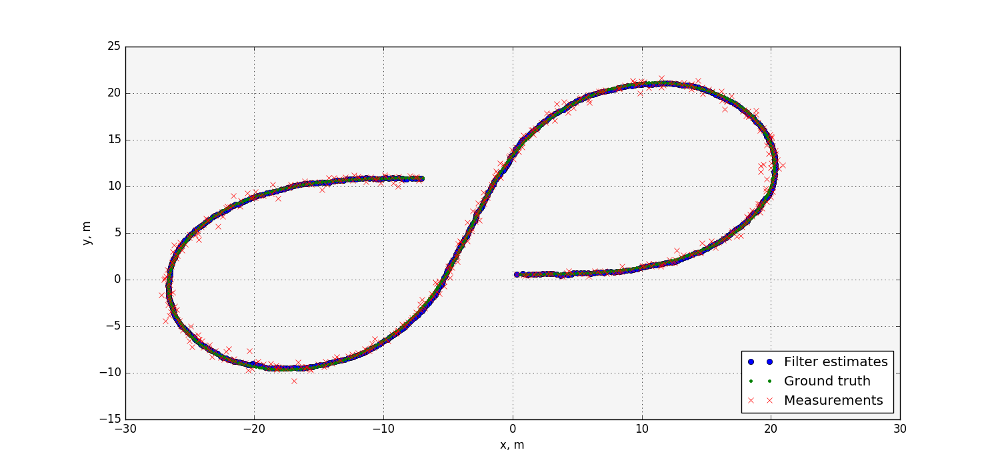
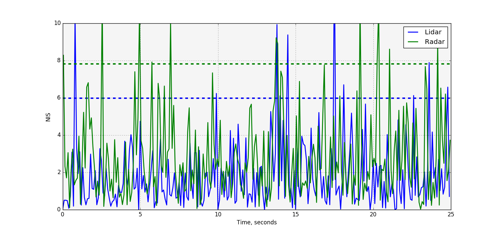

# Unscented Kalman Filter

This repository contains C++ code implementing an unscented Kalman filter for
object tracking on noisy lidar and radar measurements.

To build run `cmake .. && make` from the `build` directory.

Running against the sample data-set achieves RMS error values as follows.

| variable | RMSE   |
|----------|--------|
| p_x      | 0.0695 |
| p_y      | 0.0980 |
| v_x      | 0.342  |
| v_y      | 0.241  |

## Additional output

The [evaluate.py](evaluate.py) script generates the following plots from the
output data file:

* Plot of measurements, ground truth and filtered values for the x- and
y-positions, demonstrating how the filter removes measurement noise from its
estimates:

* Plot of normalised innovation squared (NIS) values for the lidar and radar
estimates, along with 95% line for a chi-squared distribution. This plot can
be helpful when tuning parameters (i.e. process noise estimates):

